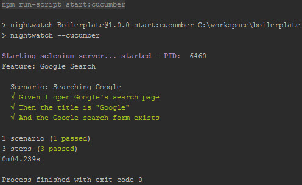
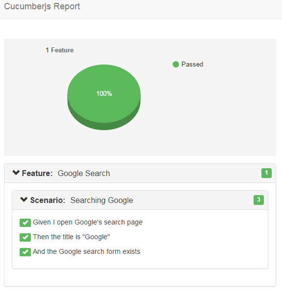

# nightwatch-boilerplate
boilerplate for nightwatch.js with selenium

Original Framework is from https://github.com/nightwatchjs/nightwatch and also from https://github.com/mucsi96/nightwatch-cucumber

I  created a Boilerplate for nightwatch to use with and also without nightwatch-cucumber.

## Install Nightwatch Boilerplate

First you need to install Node.js (https://nodejs.org/en/) and Java.

Then...
```sh
$ git clone https://github.com/christinezierold27/nightwatch-boilerplate.git
$ cd nightwatch-boilerplate
$ npm install
```

## Run Tests

In this boilerplate you find one test which does a simple GUI Test in Google. The configuration is set up (nightwatch.conf.js) that the selenium server is started with the test and you do not have to start the server manuelly. The test is saved under tests/src/ and also as a cucumber version under features/group .

#### to start plain Nightwatch test (tests/src/)

```sh
$ cd nightwatch-boilerplate
$ npm start
```

#### to start cucumber Nightwatch test (features/group)

```sh
$ cd nightwatch-boilerplate
$ npm start:cucumber
```


## reports
### for cucumber
under features\reports will be a HTML Report created after each cucumber test run.



## configuration

There are two config files in this project. One in the main folder (`nightwatch.conf.js`) for all the general configurations and one under `tests/nightwatch.conf.js` for the specific configuration for the plain nightwatch tests.

### to set up the default starting browser
open nightwatch.conf.js in the main folder

under test_settings --> default --> desiredCapabilities --> browserName  you can change the value to chrome or firefox to change the browser

### to set up that the selenium server starts with tests
open nightwatch.conf.js in the main folder

under selenium --> start_process  set the value of TRUE to set up that the selenium server starts with the test

## Use Docker
In the `docker-compose.yml` are one Selenium Hub (2.53.1) and two nodes (chrome and firefox) configured. The Images are from https://github.com/SeleniumHQ/docker-selenium

To start/build the Docker containers run this:

```sh
$ docker-compose up -d
```

After that the containers for the Grid and Nodes are build and ready to use.

### usage under Windows 7

If you use Windows 7 you may have to change the value for server_path for the selenium server because Windows7 uses `docker-machine` and that's why the selenium server container is not reachable via the service name 'seleniumhub'. You find this setting in the `nightwatch.cong.js`:
```sh
selenium : {
        server_path : dockerSeleniumHub
        ...
```
